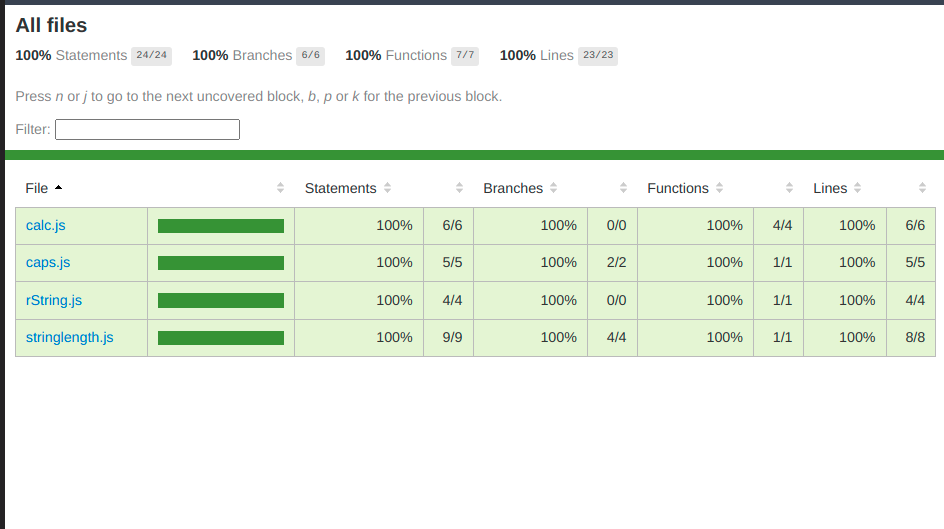

## Testing using Jest
In this project, I am testing JavaScript files using Jest by writing various test functions and making sure that all tests pass.



## Built With
* JS
* Jest


## Software Requirements
* Node.JS
* npm
* Code Editor
* Git

## Installation
* Clone the repo using the command below

```
git clone git@github.com:charlesgobina/jest-test.git
```

* Navigate to the directory in which you cloned the project and use the command below

```
cd jest-test
```

```
npm test
```

## Authors
Charles Gobina :student: 
* Github:https://github.com/charlesgobina 
* Twitter:https://twitter.com/i4mCloud
* LinkedIn:https://www.linkedin.com/in/charles-gobina-74a0ab193/

## Authors
Charles Gobina :student: 
* Github:https://github.com/charlesgobina 
* Twitter:https://twitter.com/i4mCloud
* LinkedIn:https://www.linkedin.com/in/charles-gobina-74a0ab193/

## Show your support
Give a 	:star: if you like this project.

## License :memo:
This project is [MIT](https://github.com/microverseinc/readme-template/blob/master/MIT.md) licensed